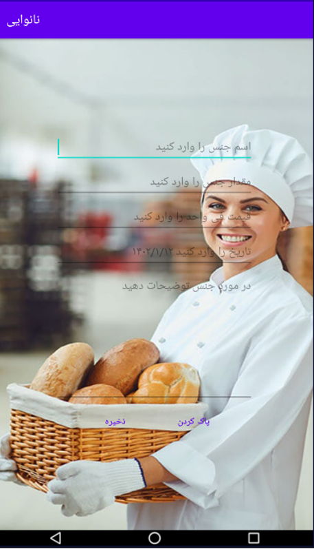
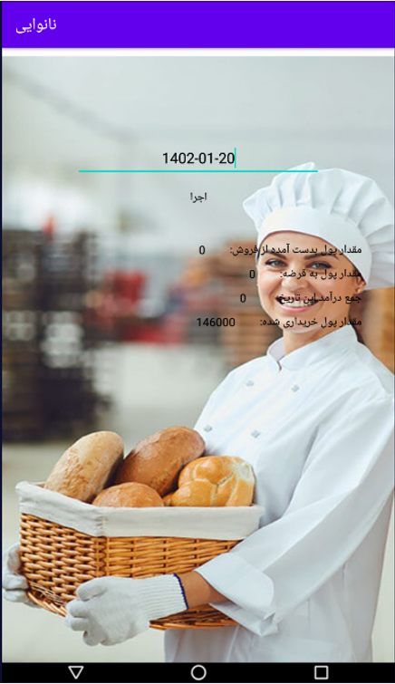

Here’s a complete example of a `README.md` for your **BakeryManager Android Kotlin** project, including screenshots and a brief project description:

---

```markdown
# 🍞 Bakery Manager Android App

**BakeryManager** is an Android application developed in Kotlin that helps bakery businesses manage their materials, employees, sales, loans, and customers. The app offers an intuitive interface and local storage to manage the daily operations of a bakery efficiently.

## 📱 Features

- Add, update, and view employees
- Manage customers and update customer information
- Track loans and materials
- Record and update sales
- Generate reports
- SQLite-based local database
- User-friendly UI using Android Activities


## 🖼️ Screenshots

| Home Page | Add Sale | Sales List | Reports |
|-----------|----------|------------|---------|


*(Home page to have routing to add section)*

*(Sale management)*

*(Listing the sales with update and delate)*

*(Report generation)*

## ⚙️ How to Build

1. Open the project in **Android Studio**.
2. Let Gradle sync the project.
3. Connect your emulator or physical device.
4. Click **Run** or use `Shift + F10`.

## 📦 Dependencies

- Kotlin
- Android SDK
- SQLite (for local database)
- AndroidX Libraries

## 👨‍💻 Author

**Karim Farhang**

## 📝 License

This project is open-source and available under the [MIT License](LICENSE).
```

---

### ✅ How to Use

1. Save the above content as `README.md` in your root project folder (`BakeryManager-android-Kotlin`).
2. Make sure the `screenshot` folder and its images are included when pushing to GitHub.

